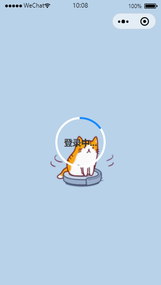

# 基于微信小程序开发的仿微信通讯小程序

## 1.前端框架-vant

使用[vant](https://youzan.github.io/vant-weapp/#/intro)小程序版前端框架进行开发。

**引入 vant** 

1.进入小程序根目录，打开cmd，输入：npm init

输入命令后一直点回车

2.输入命令：npm i @vant/weapp -S --production 

打开微信开发者工具，点击 **工具 -> 构建 npm**，并勾选 **使用 npm 模块** 选项，构建完成后，即可引入组件

## 2.功能

### 账户体系

使用微信进行注册和登录，第一次使用时进行注册，填写个人唯一编号（以供他人搜索并添加好友）

### 个人主页

直接显示从微信获取的个人信息

### 好友

实现好友列表，好友请求列表，好友请求功能

### 聊天

在好友列表发起聊天后，会在聊天列表显示，底部菜单栏会显示红点以提示收到好友消息

### 发现页功能

时事新闻功能使用聚合数据的api

## 3.后台

使用时需修改IP地址，文件路径为：utils/common.js  

后台项目：[jinjidecj](https://github.com/jinjidecj)/**[wechat-imitate-server](https://github.com/jinjidecj/wechat-imitate-server)**

仅供学习，禁止商业用途